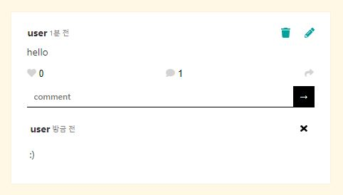
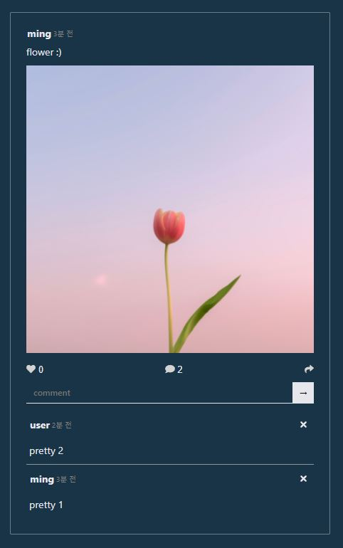

# **Switter** (sweet+twitter)

### Cloning Twitter with React and Firebase.

### URL: https://vanillovin.github.io/switter/#/

# 기술 스택

- Front - HTML CSS JS React
- Back - Firebase

# 기능 소개

1. 이메일 비번 or 구글 깃허브 로그인 회원가입
   - abcd@email.com / 123456 계정으로 테스트 가능
   - **회원정보는 개인 및 상업적 용도로 사용하지 않습니다**
   - 
2. 게시글
   1. 사용자 displayname과 올린 시간 표시
   2. 좋아요 기능 (9.30 추가)
   3. 댓글 기능 (10.1 추가)
   - 
   - 
3. 프로필
   - 
4. 메신저
   - 랜덤 짧은 글귀
   - 
5. 다크모드
   - 9.29 추가!
   - 
   - 

# TODO

1. 최적화
2. 팝업모달창
3. 이메일 변경
4. 회원가입 컨테이너
5. 회원정보 변경 & 인증
6. 로그인 하지 않고 읽기
